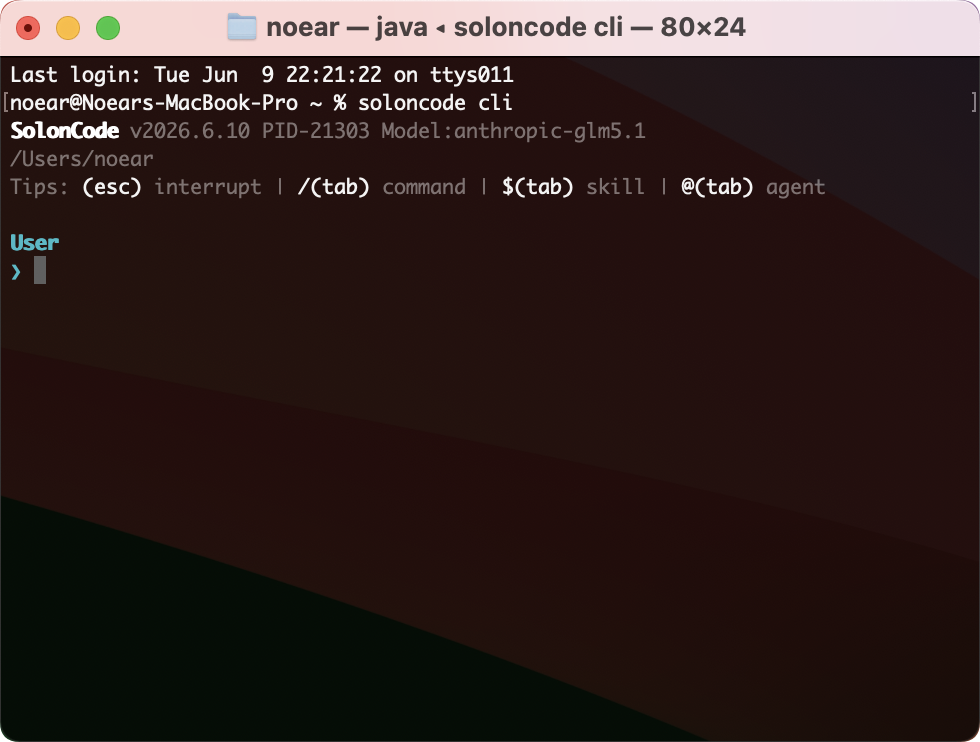
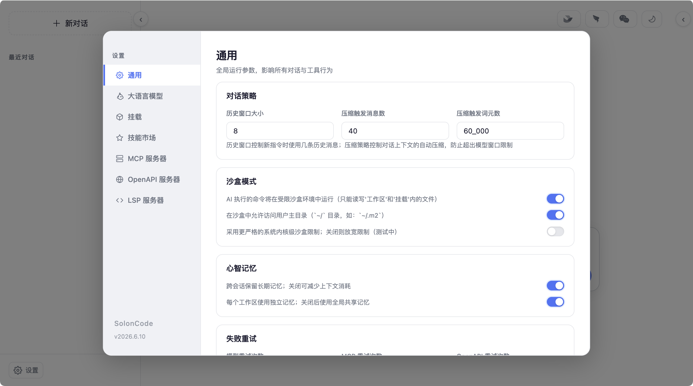

<div align="center">
<h1>SolonCode</h1>
<p>An open-source coding agent built with <a href="https://github.com/opensolon/solon-ai">Solon AI</a> and Java (supports Java8 to Java26 runtime environments)</p>
<p>Latest Version: v2026.5.2</p>


</div>

<div align="center">

[中文](docs/README.zh.md) | [日本語](docs/README.ja.md) | [한국어](docs/README.ko.md) | [Deutsch](docs/README.de.md) | [Français](docs/README.fr.md) | [Español](docs/README.es.md) | [Italiano](docs/README.it.md)

[Русский](docs/README.ru.md) | [العربية](docs/README.ar.md) | [Português (BR)](docs/README.br.md) | [ไทย](docs/README.th.md) | [Tiếng Việt](docs/README.vi.md) | [Polski](docs/README.pl.md)

[বাংলা](docs/README.bn.md) | [Bosanski](docs/README.bs.md) | [Dansk](docs/README.da.md) | [Ελληνικά](docs/README.gr.md) | [Norsk](docs/README.no.md) | [Türkçe](docs/README.tr.md) | [Українська](docs/README.uk.md)

</div>


## Installation and Configuration

Installation:

```bash
# Mac / Linux:
curl -fsSL https://solon.noear.org/soloncode/setup.sh | bash

# Windows (PowerShell):
irm https://solon.noear.org/soloncode/setup.ps1 | iex
```

Configuration (must be modified after installation):

* Installation directory: `~/soloncode/bin/`
* Locate the `~/soloncode/config.yml` configuration file and modify the `models` configuration (primarily)
* For `models` configuration options, refer to: [Model Configuration and Request Options](https://solon.noear.org/article/1087)

## Running

Run the `soloncode` command from any directory in the console (i.e., your workspace).

```bash
demo@MacBook-Pro ~ % soloncode
SolonCode v2026.5.2
/Users/noear
Tips: (esc) interrupt | /(tab) ls commands

User
> 
```

Feature Testing (try the following tasks, from simple to complex):

* `你好`
* `用网络分析下 ai mcp 协议，然后生成个 ppt` // It's recommended to install some skills in advance
* `帮我设计一个 agent team（设计案存为 demo-dis.md），开发一个 solon + java17 的经典权限管理系统（demo-web），前端用 vue3，界面要简洁好看`


## Documentation

For more configuration details, please visit our [Official Documentation](https://solon.noear.org/article/soloncode).

## Contributing

If you're interested in contributing code, please read the [Contributing Docs](https://solon.noear.org/article/623) before submitting a PR.

## Developing Based on SolonCode

If you use "soloncode" in your project name (e.g., "soloncode-dashboard" or "soloncode-app"), please indicate in the README that the project is not officially developed by the OpenSolon team and has no affiliation.

## FAQ: What's the difference from Claude Code and OpenCode?

They are functionally similar, with key differences:

* Built with Java, 100% open-source.
* Pure Chinese prompt-driven development and construction.
* Provider-agnostic. Requires model configuration. Model iteration will narrow gaps and reduce costs, making provider-agnostic approach important.
* Focused on terminal command-line interface (CLI), running via system commands.
* Supports Web, ACP protocol for remote communication.